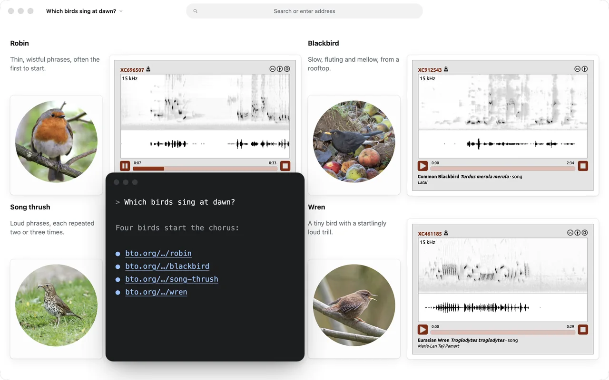

# Banquish for Claude Code

Banquish lets your agent answer with the live web. Ask a question, and instead of a wall of text and links, Claude opens the real pages in Banquish, takes the parts that answer you (a price, a chart, a player, a table) and composes them into a Workspace beside your terminal. Those parts are live pieces of the sites themselves, so they keep updating, and you can click, play and scroll them. Banquish is a Mac app (Apple silicon); this repository is its Claude Code plugin.



## Install

First install the Banquish app:

- Download it from [banquish.space](https://banquish.space) (the download is coming soon), or
- with Homebrew (coming soon): `brew install --cask banquish-app/tap/banquish`

Open Banquish once. Its **Connect your agent** card sets up the agents below.

### Claude Code

Add this plugin:

```
/plugin marketplace add banquish-app/banquish-plugin
/plugin install banquish@banquish
```

Then, in Banquish, click **Add to Claude Code** under Connect your agent. That installs `~/.banquish/bin/banquish`, the command the plugin runs. Restart Claude Code, and ask something like "compare the three cheapest flights to Lisbon next Friday, show it in Banquish".

The plugin adds:

- the `banquish` MCP server, which runs `~/.banquish/bin/banquish mcp`;
- the `banquish` skill, which tells Claude when to answer in Banquish and how to help you install it when it's missing.

If you clicked Add to Claude Code before installing the plugin, that's fine: Claude Code sees both run the same command and connects once.

### Codex

In Banquish, click **Add to Codex** under Connect your agent, then start a new Codex session.

### Claude Desktop

In Banquish, click **Add to Claude Desktop** under Connect your agent, then quit Claude Desktop and open it again.

### Any other MCP client

In Banquish, open **Any other MCP client** under Connect your agent and click **Copy**. Add the configuration it copies to your client's MCP settings. It runs `~/.banquish/bin/banquish mcp` over stdio.

## What runs on your machine

The plugin contains no code. Its MCP server is the `~/.banquish/bin/banquish` script that Banquish installs, which relays the agent's MCP messages to the Banquish app on your Mac and opens Banquish if it's closed. The plugin itself sends nothing anywhere. Banquish opens the pages your agent asks for, as your browser would.

## Privacy

See [banquish.space/privacy](https://banquish.space/privacy) for what Banquish and its site collect.

## Support

Open an issue in this repository, or write to [hello@banquish.space](mailto:hello@banquish.space).

## License

The plugin is MIT licensed; see [LICENSE](LICENSE). The Banquish app is distributed separately.
